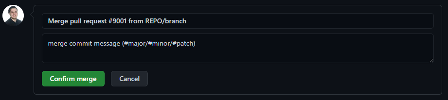

auto-tagger
===

# Introduction

This is a simple github action that is triggered on github PR merging that will increment the git tag on the merge commit following [semver](https://semver.org) and add a comment to the merged commit with the new tag.

# Installation

To use this, simply define an action configuration yaml in the `.github/workflows` directory of your repository with the following contents:
```
name: auto_tagger
on:
  pull_request:
   types: [closed]
jobs:
  build:
    if: github.event_name == 'pull_request' && github.event.action == 'closed' && github.event.pull_request.merged == true
    runs-on: ubuntu-20.04
    steps:
    - uses: actions/checkout@master
      with:
        fetch-depth: 0
    - name: Bump version and push tag
      uses: RueLaLa/auto-tagger@master
      env:
        GITHUB_TOKEN: ${{ secrets.GITHUB_TOKEN }}
```

The default Github token created for the action to use has enough permissions to checkout, tag, and push the new tag on the repo that this action is defined in.

# Usage

Once installed, when merging a pull request, simply include either `#major`, `#minor`, or `#patch` to the commit message. Alternatively, if you don't include of these, a patch level bump will be assumed. Below is an example from the pull request page:

